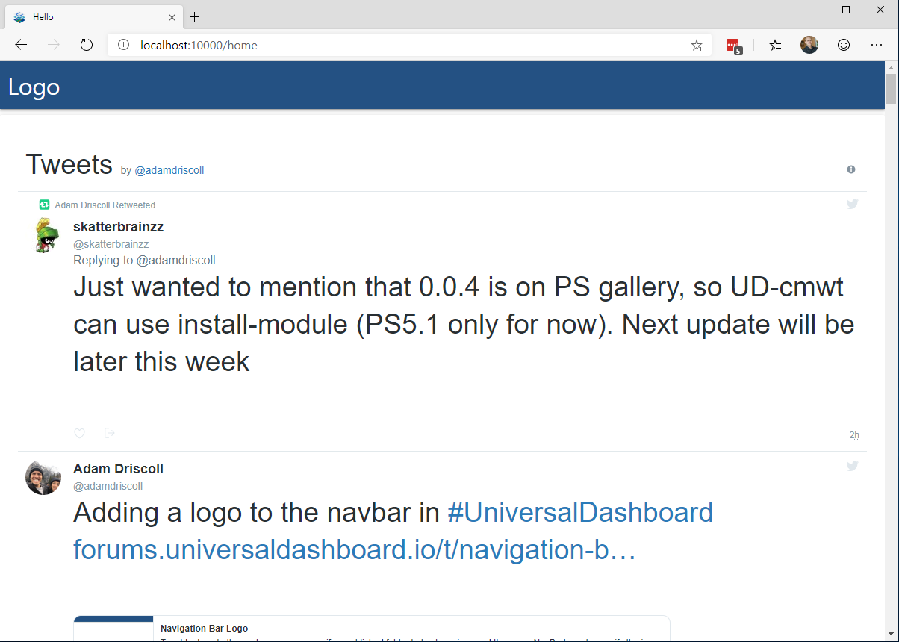

# ud-helmet

[React Helmet](https://github.com/nfl/react-helmet) support for Universal Dashboard

# About

UD-Helmet allows you to specify elements that will modify the `<head>` of the Universal Dashboard document. 

# Installation 

```
Install-Module UniversalDashboard.Helmet
```

# Example

```
Import-Module UniversalDashboard
Import-Module UniversalDashboard.Helmet

$Dashboard = New-UDDashboard -Title "Test" -Content {
    New-UDCard -Content {
        New-UDHtml -Markup '<a class="twitter-timeline" href="https://twitter.com/adamdriscoll?ref_src=twsrc%5Etfw">Tweets by adamdriscoll</a>'
        New-UDHelmet -Content {
            New-UDHtmlTag -Tag 'script' -Attributes @{
                src = 'https://platform.twitter.com/widgets.js'
                async = "true"
            }
            New-UDHtmlTag -Tag 'title' -Content { "Hello" }
        }
    }
} 
Start-UDDashboard -Dashboard $Dashboard -Port 10000 -Force 
```


